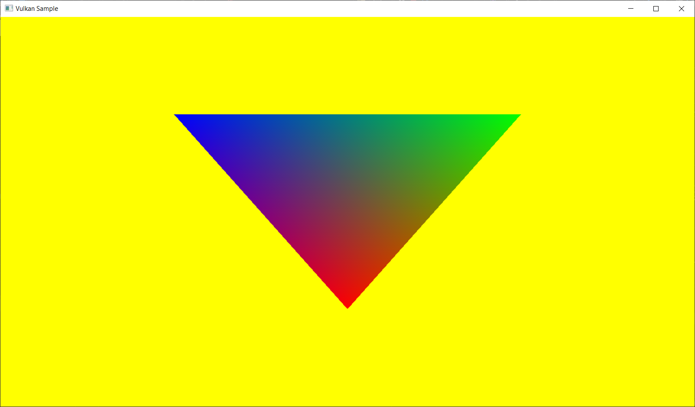
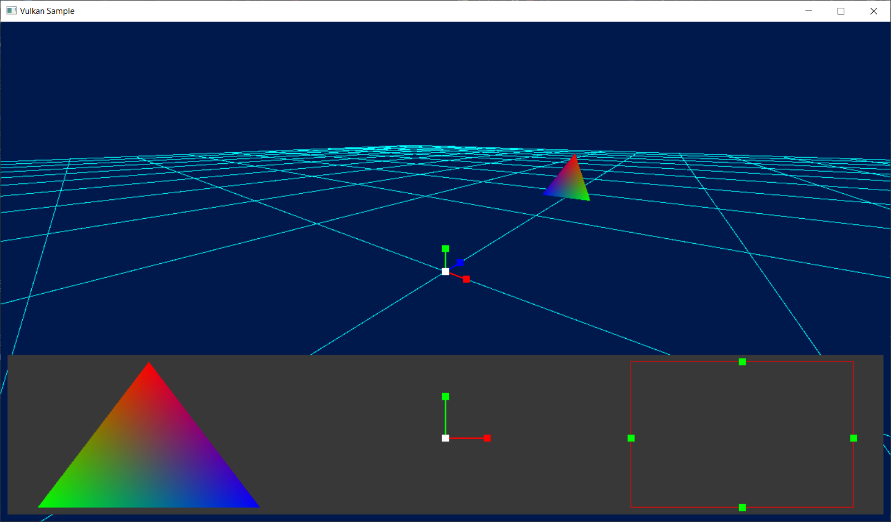
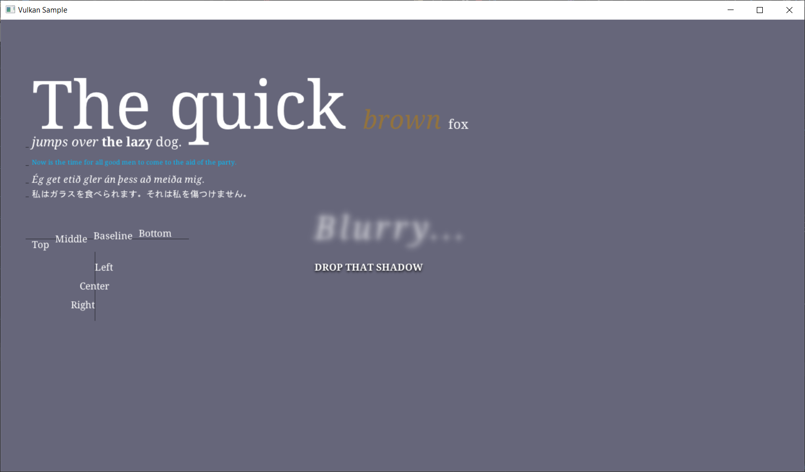
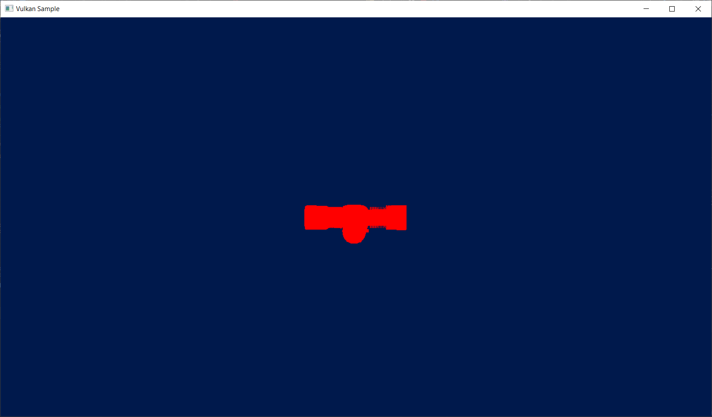
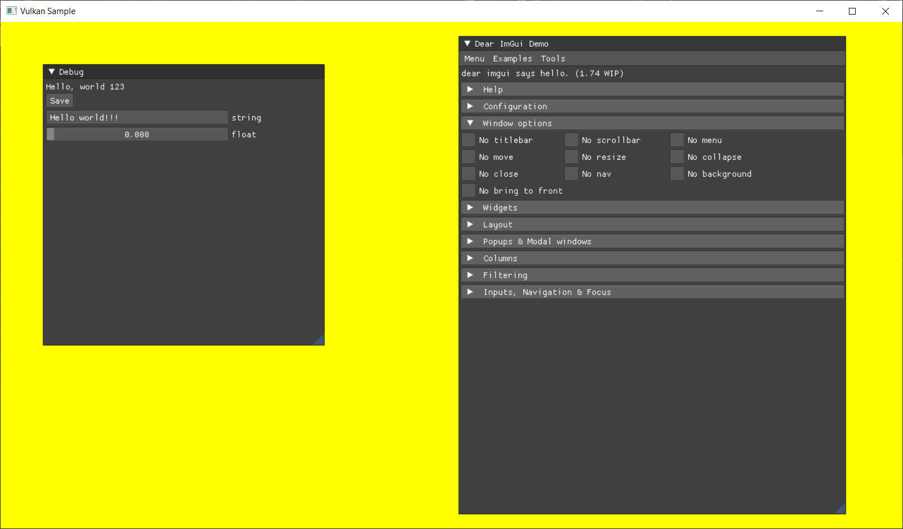
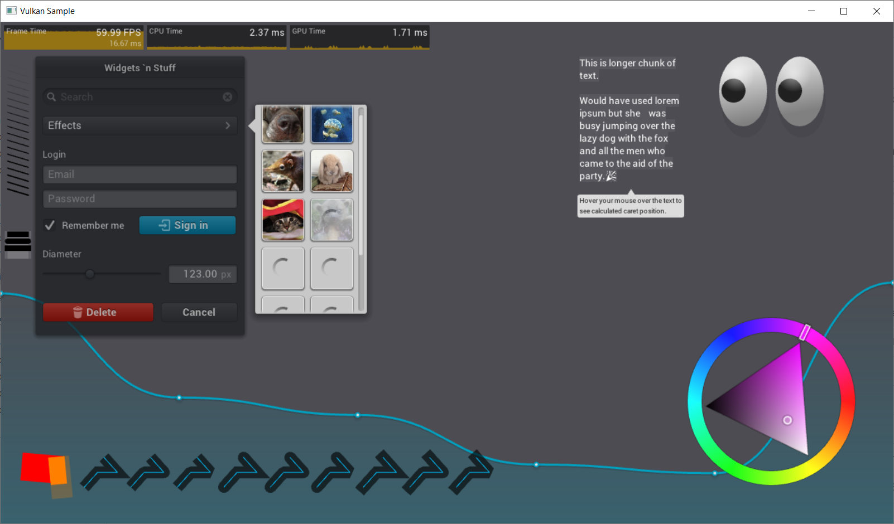

# Rendering Engine Infrastructure(REI) project

## Overview

REI is a cross-platform rendering framework. It functions as a comprehensive graphics API and is adaptable to various platforms, including PC, consoles, and mobile. It simplifies porting, especially for games developed on custom or proprietary engines. REI can serve as a cross-platform API as well as a helper library for platform-specific API. 

## Supported platforms:

* Windows 10+ using DirectX 12 and Vulkan
* Android using Vulkan
* Steam Deck using Vulkan
* Xbox One\*
* Xbox Series X/S\*
* Playstation 4\*
* Playstation 5\*
* Nintendo Switch\*

\*Only available for accredited developers via licensing

## PC Windows Requirements:

1. Windows 10+ is required
2. Install drivers compatible with Vulkan 1.3 if necessary
3. Install Visual Studio 2022 and Windows SDK.
4. REI requires Vulkan SDK (https://vulkan.lunarg.com/sdk/home).
5. REI uses vcpkg for dependency management (https://vcpkg.io/en/)
6. Ensure vcpkg is integrated with MSBuild / Visual Studio - run if necessary
   ```
   vcpkg integrate install
   ```
7. Install the DirectX shader compiler using vcpkg
   ```
   vcpkg install directx-dxc:x86-windows directx-dxc:x64-windows
   ```
8. Install SDL2 using vcpkg
   ```
   vcpkg install sdl2:x86-windows sdl2:x64-windows
   ```
9. Build solution which is located at `\<path to repo\>\sources\REI_Platforms\windows\VSProjects\REI.sln`

## Samples

Here are some samples where REI was used.

### 1. Triangle

This sample shows the classic ‘Hello World’ triangle.



### 2. Basic Draw

This sample shows basic geometry rendering, with a rotating camera. 



### 3. Fontstash

This sample shows a fontstash example (https://github.com/memononen/fontstash) with REI as a rendering backend.



### 4. GLTF

This sample shows GLTF model loading and display.



### 5. ImGUI

This sample shows how to use REI with ImGUI (https://github.com/ocornut/imgui).



### 6. NanoVG

This sample shows a NanoVG example (https://github.com/memononen/nanovg) with REI as a rendering backend.



## Notes

* REI uses HLSL shaders for integrations and samples.
* Currently there isn't a dedicated shader compiler solution integrated with REI; all shaders for samples are compiled with the help of custom build steps in Visual Studio Projects. Please refer to REI_Integration.vcxproj, sample_triangle.vcxproj, sample_gltf.vcxproj for examples.
* `REI_PLATFORM_<platform_name>=1` was declared in the vcxproj/props files of a specific platform. `REI_PLATFORM_WINDOWS` is used for Windows.
* To enable PIX capturing for windows first you need to define `REI_ENABLE_PIX=1` in RendererD3D12.h or project file.
* You also need to install WinPixEventRuntime using NuGet. To do this, perform these steps:
  1. Right-click on the solution in Solution Explorer.
  2. Click "Manage NuGet Packages for Solution".
  3. Select the "Browse" tab.
  4. Type "WinPixEventRuntime" into the search box.
  5. Select the package.
  6. Select all related projects (or just all) participating in the build with pix3.h.
  7. Click "Install".
  8. If `packages.config` is not added to all selected projects you can manually reinstall it using "Manage NuGet Packages" when you right-click a specific project. Or you can click to  Tools -> NuGet Package Manager -> Package Manager Console. Then run: `update-package -reinstall`
* The descriptorIndex field in REI_DescriptorData represents the actual position in the descriptor table. This index is determined by the REI_DescriptorBinding order in the pBindings array of the REI_DescriptorTableLayout structure and the descriptorCount field of the REI_DescriptorBinding structure.
* RendererVk.h contains `USE_RENDER_DOC` define which adds VK_LAYER_RENDERDOC_Capture layer to instance.
* RendererVk.h contains `USE_DEBUG_UTILS_EXTENSION` define which adds VK_EXT_debug_utils extension to instance.
* RendererVk.h contains `REI_VK_ALLOW_BARRIER_INSIDE_RENDERPASS` when enabled, a warning will be displayed, otherwise `ASSERT(false)` will be triggered when the user uses REI_cmdResourceBarrier inside a renderpass. If enabled, it closes the open render pass when a resource barrier is requested and opens another render pass.
* For D3D12 REI has 35 vertex semantic definitions. These include common semantics like POSITION, TEXCOORD, NORMAL, etc. and 16 USERDEFINED semantics. For your inputs, you can use any semantic you want regardless of its naming, if you correctly specify it in the shader: REI_SEMANTIC_POSITION0 must be specified as a POSITION0 in the shader. REI_SEMANTIC_USERDEFINED11 must be specified as a USERDEFINED11 in the shader. You can use defines to have custom names for semantics (see `defines.hlsli`).


# Open-Source Libraries

REI utilizes the following Open-Source libraries and tools:
* [REI](https://github.com/Vi3LM/REI)
* [The Forge](https://github.com/ConfettiFX/The-Forge)
* [tinyrenderers](https://github.com/chaoticbob/tinyrenderers)
* [Vulkan Memory Allocator](https://github.com/GPUOpen-LibrariesAndSDKs/VulkanMemoryAllocator)
* [D3D12 Memory Allocator](https://github.com/GPUOpen-LibrariesAndSDKs/D3D12MemoryAllocator)
* [SPIRV-Reflect](https://github.com/KhronosGroup/SPIRV-Reflect)
* [renderdoc](https://github.com/baldurk/renderdoc)
* [Dear ImGui](https://github.com/ocornut/imgui)
* [Fontstash](https://github.com/memononen/fontstash)
* [nanovg](https://github.com/memononen/nanovg)
* [cgltf](https://github.com/jkuhlmann/cgltf)
* [Nothings](https://github.com/nothings/stb) single file libs 
  * [stb_image.h](https://github.com/nothings/stb/blob/master/stb_image.h)
  * [stb_image_write.h](https://github.com/nothings/stb/blob/master/stb_image_write.h)
  * [stb_truetype.h](https://github.com/nothings/stb/blob/master/stb_truetype.h)
* [DirectX Shader Compiler](https://github.com/Microsoft/DirectXShaderCompiler)
* [SDL2](https://github.com/libsdl-org/SDL)
* [vcpkg](https://github.com/microsoft/vcpkg)
* [smhasher](https://github.com/aappleby/smhasher/) bits of MurmurHash3 and MurmurHash2
